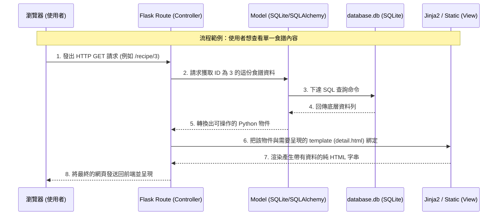

# 系統架構設計

## 1. 技術架構說明

### 選用技術與原因
- **後端框架：Python + Flask**  
  Flask 是一個輕量且非常有彈性的 Python 網頁開發框架。對於像食譜收藏夾這樣的專案，它可以快速起步並處理路由邏輯，學習曲線平緩，適合快速開發與驗證想法。
- **模板引擎：Jinja2**  
  搭配 Flask 原生的 Jinja2 模板，能直接將後端資料動態注入並渲染到前端的 HTML 中。由於本專案不需複雜的前後端分離配置，這樣的渲染機制可以讓開發流程簡單高效。
- **資料庫：SQLite (可搭配 SQLAlchemy ORM)**
  選用 SQLite，因為它是基於檔案的輕量級資料庫系統，不需額外架設資料庫伺服器，非常符合個人使用的架構；搭配 SQLAlchemy 可以帶來直覺的 Python 物件操作體驗，並有效防範 SQL Injection。

### Flask MVC 模式說明
雖然 Flask 不強求嚴格的架構，但在這次的目錄與程式中，我們會遵循相似 MVC（Model-View-Controller）職責：
- **Model（模型）**：負責系統的核心「資料與商業規則」。在我們建立的 `models/` 目錄中，會透過 Python 類別或原生 SQL 的方式，定義「食譜」的各個欄位以及與資料庫的關聯。
- **View（視圖）**：負責「畫面呈現」。在 `templates/` 之中的 Jinja2 檔案負責架構版面，再加上 `static/` 裡的 CSS / JS，負責打造漂漂亮亮的視覺介面，提供給使用者互動。
- **Controller（控制器）**：負責「接受請求並協調一切」。在 `routes/` 以及啟動配置中，它接到使用者的請求後（比如提交新食譜的表單），會驅動 Model 去要資料或存資料，再把處理好的結果拿去讓 View 生成最終 HTML 送回去瀏覽器。

---

## 2. 專案資料夾結構

本專案將依照以下架構劃分目錄：

```text
web_app_development/
├── app/                  # 應用程式的核心模組
│   ├── __init__.py       # Flask 實例初始化、藍圖與資料庫設定
│   ├── models/           # ★ Model 層：定義資料庫與各實體的關聯
│   │   ├── __init__.py
│   │   └── recipe.py     # 定義食譜 (Recipe) 等資料表設定
│   ├── routes/           # ★ Controller 層：負責處理來自瀏覽器的各項路由請求
│   │   ├── __init__.py
│   │   └── main_routes.py# 處理首頁列表、新增、詳情等操作頁面
│   ├── templates/        # ★ View 層：Jinja2 生成 HTML
│   │   ├── base.html     # 主要的共同母版 (導覽列、共用 Header)
│   │   ├── index.html    # 顯示所有食譜列表的首頁
│   │   ├── detail.html   # 單獨觀看食譜詳情的頁面
│   │   └── create.html   # 填寫食譜內容的新增表單
│   └── static/           # 靜態資源 (只發送供瀏覽器讀取用的檔案)
│       ├── css/
│       │   └── style.css # 掌控整個應用程式的樣式
│       ├── js/           
│       │   └── app.js    # 用作增強體驗的前端互動 (若有需要)
│       └── images/       # 圖片存放處
├── instance/             # 存放本地端非公開存取的資料檔案
│   └── database.db       # 生成出的 SQLite 檔案本體
├── docs/                 # 設計文件存放區
│   ├── PRD.md            # 產品需求文件
│   └── ARCHITECTURE.md   # [這份文件] 系統架構設計
└── run.py                # 整個應用程式對外的啟動入口
```

---

## 3. 元件關係圖

以下展示各元件之間是如何互相呼叫的互動流程：



---

## 4. 關鍵設計決策

以下是一些能讓專案架構更容易維護與擴展的重要考量：

1. **目錄結構化與模組化 (Blueprints 藍圖的使用)**
   - 我們把 `models/` (資料)、`routes/` (路由)、與 `templates/` (顯示) 彼此獨立出來，並不在 `app.py` 裡通通寫在一起。使用 Flask Blueprints（藍圖）管理這一切，確保未來就算想加入像是「登入/會員管理」模組，也可以直接新增資料夾，互不干涉。
2. **繼承式的 Template 佈局設計**
   - 不在每一個頁面重寫導航列跟底部宣告欄，我們利用 Jinja2 的 ``，確保所有頁面的外觀一致，若日後修改版面也只需改動一處。
3. **資料庫獨立存放在 `instance/` 資料夾中**
   - 把 `database.db` 放在程式工作目錄的 `instance/` 資料夾下，一方面這確保我們可以簡單將這資料夾放入 `.gitignore` 避免外洩真實資料或互相覆蓋，也保障了環境的隔離與安全性。
