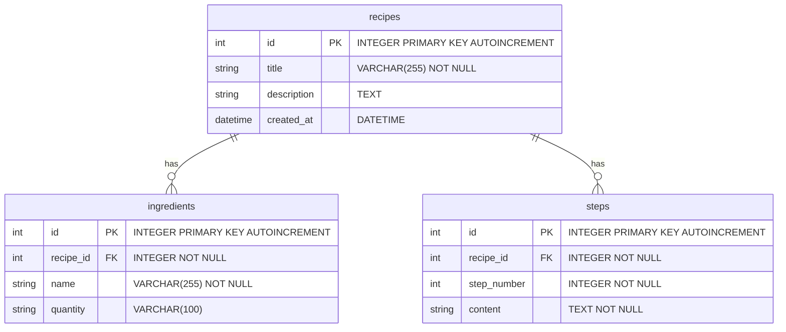

# 資料庫設計文件 (DB Design)

## 1. ER 圖（實體關係圖）

## 2. 資料表詳細說明

### recipes (食譜表)
用來儲存食譜的基本資訊。
- `id`: 食譜的唯一識別碼 (INTEGER, Primary Key, AUTOINCREMENT, 必填)
- `title`: 食譜名稱 (VARCHAR(255), 必填)
- `description`: 食譜簡介或心得 (TEXT, 選填)
- `created_at`: 建立時間 (DATETIME, 預設為當前時間)

### ingredients (材料表)
用來記錄每一道食譜所需的食材與份量。
- `id`: 材料的唯一識別碼 (INTEGER, Primary Key, AUTOINCREMENT, 必填)
- `recipe_id`: 關聯的食譜 ID (INTEGER, Foreign Key 參考 `recipes.id`, 必填)
- `name`: 食材名稱 (VARCHAR(255), 必填)
- `quantity`: 數量與單位，如「1茶匙」 (VARCHAR(100), 選填)

### steps (製作步驟表)
用來記錄烹飪的詳細流程。
- `id`: 步驟的唯一識別碼 (INTEGER, Primary Key, AUTOINCREMENT, 必填)
- `recipe_id`: 關聯的食譜 ID (INTEGER, Foreign Key 參考 `recipes.id`, 必填)
- `step_number`: 步驟順序，如 1, 2, 3 (INTEGER, 必填)
- `content`: 該步驟的詳細說明內容 (TEXT, 必填)

## 3. SQL 建表語法
完整的 CREATE TABLE SQL 語法已儲存於 `database/schema.sql` 檔案中。

## 4. Python Model 程式碼
基於架構設計文件的建議，專案使用 **SQLAlchemy** 作為 ORM 框架，對應的 Model 已放置於 `app/models/` 目錄中。
- `app/models/__init__.py`: 存放 SQLAlchemy db 實例。
- `app/models/recipe.py`: 實作 Recipe Model 與 CRUD。
- `app/models/ingredient.py`: 實作 Ingredient Model 與 CRUD。
- `app/models/step.py`: 實作 Step Model 與 CRUD。
