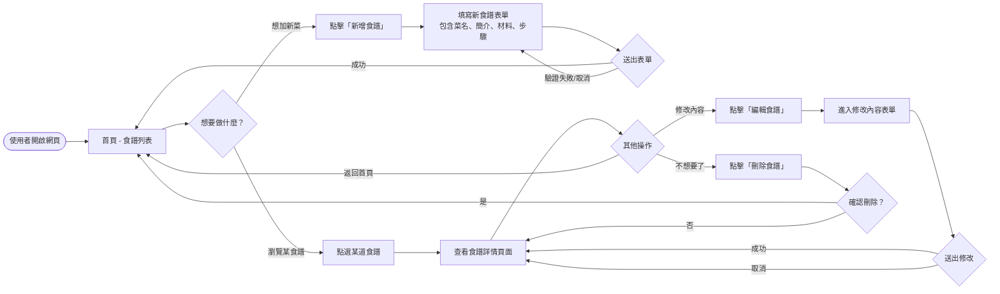
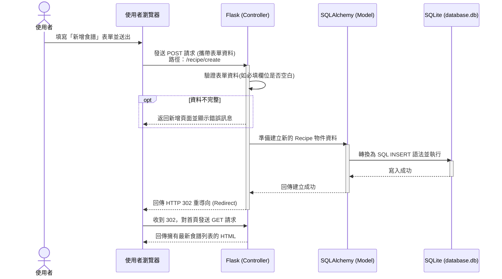

# 流程圖設計

以下是「食譜收藏夾」的使用者操作流程，以及背後的系統資料流動流程。視覺化的圖表將幫助我們釐清各個功能的頁面切換機制與資料儲存的運作邏輯。

## 1. 使用者流程圖 (User Flow)

這張圖展示了從使用者開啟網站開始，可能採取的各項操作流程。

---

## 2. 系統序列圖 (Sequence Diagram)

這裡以最核心的功能**「新增食譜」**為例，展示從使用者點擊送出表單，到資料最後存入 SQLite 的完整溝通流程。

---

## 3. 功能清單對照表

根據前面的架構規劃與使用者流程，我們定義了在後端開發時需要實作的路由以及 HTTP 方法。

| 功能名稱 | URL 路徑 | HTTP 方法 | 說明 |
| :--- | :--- | :--- | :--- |
| **首頁 (食譜列表)** | `/` | GET | 顯示所有已收藏的私人食譜名稱列表。 |
| **新增食譜 (顯示表單)** | `/recipe/create` | GET | 渲染並顯示空白的食譜填寫表單給使用者。 |
| **新增食譜 (處理送出)** | `/recipe/create` | POST | 接收填妥的資料，寫入資料庫並重新導回首頁。 |
| **查看食譜詳情** | `/recipe/<int:id>` | GET | 根據該食譜的 id，從資料庫撈取並顯示所有詳細內容。 |
| **編輯食譜 (顯示表單)** | `/recipe/<int:id>/edit` | GET | 顯示舊有資料表單供使用者修改。 |
| **編輯食譜 (處理更新)** | `/recipe/<int:id>/edit` | POST | 儲存更新後的資料並重導回該筆詳情頁面。 |
| **刪除食譜** | `/recipe/<int:id>/delete` | POST | 刪除指定的食譜並重導向至首頁。 *(防止誤觸或被搜尋引擎機器人拜訪刪除，故使用 POST)* |
